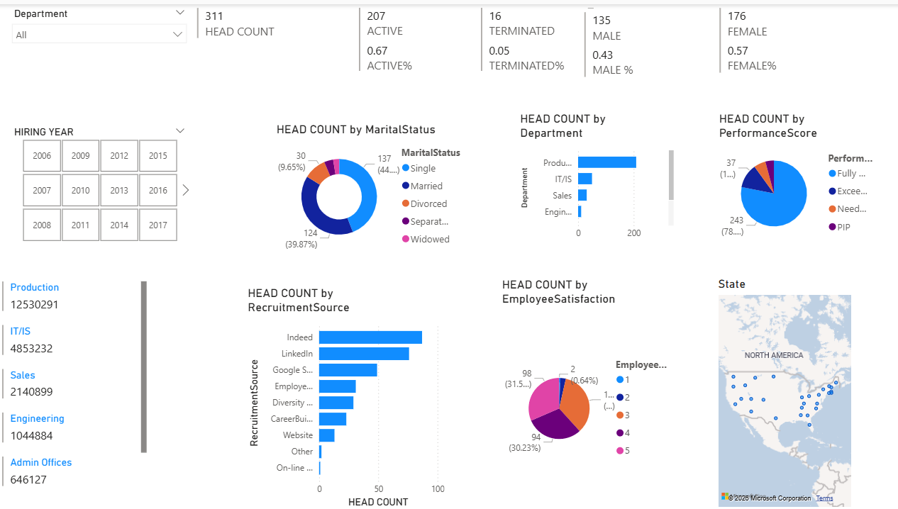
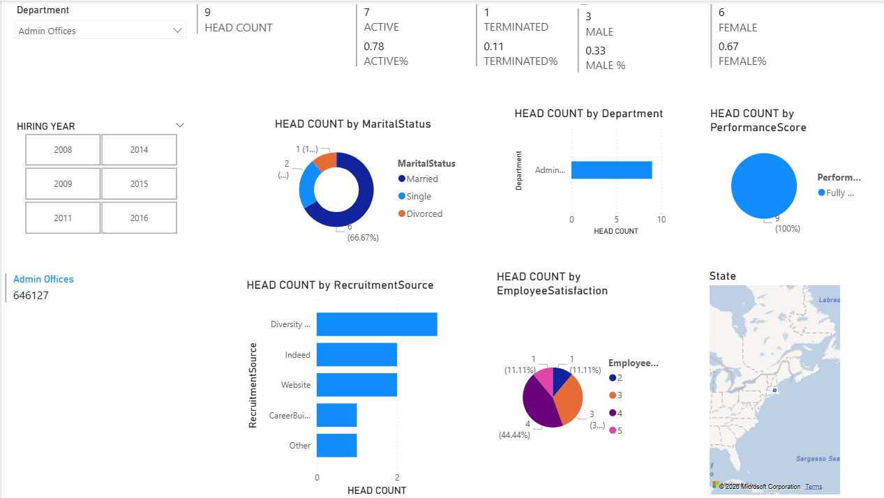
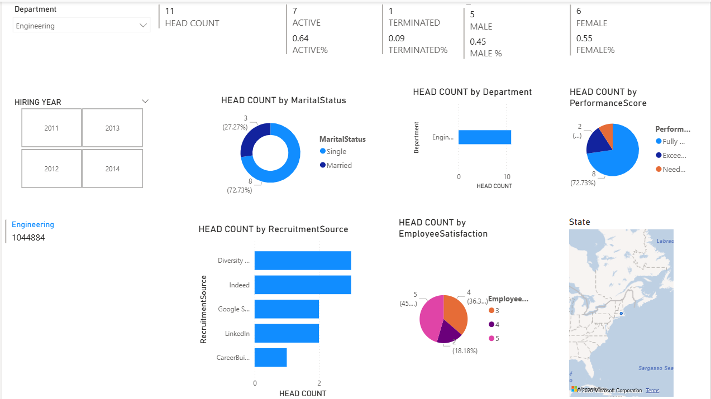
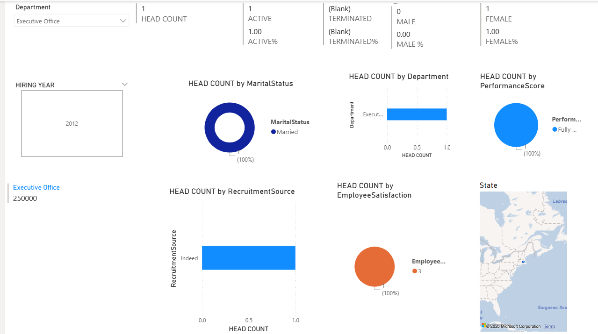
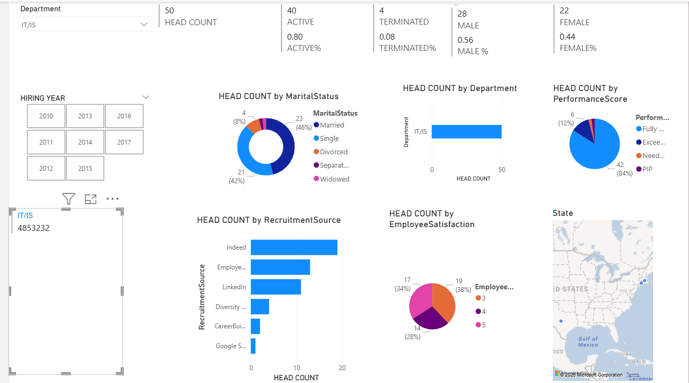
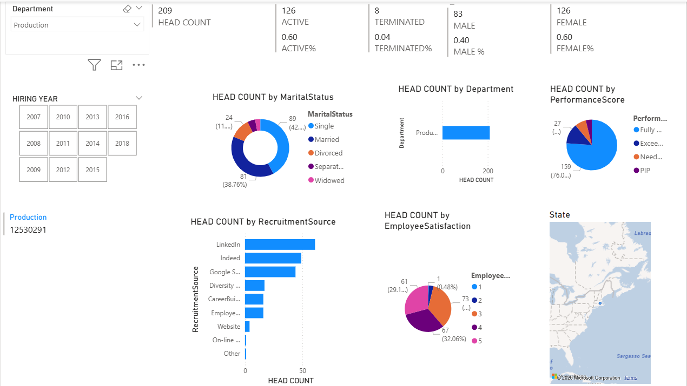

# Employee Workforce Analytics Dashboard
An interactive HR Analytics Dashboard built with Microsoft Power BI to analyze workforce demographics, employee performance, recruitment sources, hiring trends, and employee satisfaction using dynamic KPIs and visualizations
## Project Overview

The **HR Analytics Dashboard** is designed to help HR professionals and business stakeholders monitor key workforce metrics and make informed, data-driven decisions.

The dashboard consolidates employee data into interactive visualizations, allowing users to analyze employee distribution, hiring trends, performance ratings, recruitment sources, employee satisfaction, and demographic information across different departments.

## Dashboard Preview

### Overview Dashboard



### Department-wise Dashboards

#### Admin Offices



#### Engineering



#### Executive Office



#### IT/IS



#### Production



# Features
- Interactive Department Filter
- Hiring Year Slicer
- Dynamic KPI Cards
- Department-wise Workforce Analysis
- Gender Distribution
- Employee Performance Analysis
- Employee Satisfaction Analysis
- Recruitment Source Analysis
- Marital Status Distribution
- Geographic Employee Distribution
- Cross-filtering Between Visualizations

## 📂 Project Structure

```text
Employee_Workforce_Analytics/
│
├── Dashboard.pbix
├── README.md
├── LICENSE
│
├── Dataset/
│   └── HR_Dataset.xlsx
│
├── Images/
│   ├── Overview_Dashboard.png
│   ├── Admin_Offices_Dashboard.png
│   ├── Engineering_Dashboard.png
│   ├── Executive_Office_Dashboard.png
│   ├── IT_IS_Dashboard.png
│   └── Production_Dashboard.png
│
└── DAX_Measures.txt
```

- # Technologies Used
| Technology | Purpose |
|------------|---------|
| Microsoft Power BI | Dashboard Development |
| Power Query | Data Cleaning & Transformation |
| DAX | Measures & Calculations |
| Excel / CSV | Dataset |
| Data Modeling | Relationship Management |

## Business Impact

### Key Business Benefits

- Improved workforce visibility through centralized HR metrics and KPI monitoring.
- Enables quick identification of active and terminated employee trends.
- Supports workforce planning by analyzing hiring patterns across different years.
- Helps evaluate department-wise employee distribution for better resource allocation.
- Assists HR teams in monitoring gender diversity and workforce demographics.
- Provides insights into employee performance to support performance management initiatives.
- Identifies the most effective recruitment channels to optimize hiring strategies.
- Tracks employee satisfaction levels to improve engagement and retention.
- Facilitates data-driven decision-making using interactive filters and dynamic reports.
- Reduces manual reporting efforts by providing automated and interactive dashboards.

### Business Value

- Better HR decision-making
- Increased operational efficiency
- Improved employee performance monitoring
- Enhanced recruitment strategy evaluation
- Greater workforce transparency
- Faster access to critical HR insights
- Scalable reporting for organizational growth

- ## Future Improvements

- Attrition Analysis
- Salary Analytics
- Leave Management Dashboard
- Employee Retention Dashboard
- Diversity & Inclusion Dashboard
- Predictive HR Analytics

- ## Author

**Sanober Khatib**

- GitHub: https://github.com/Khatib-sanober
- LinkedIn: www.linkedin.com/in/sanober-khatib

